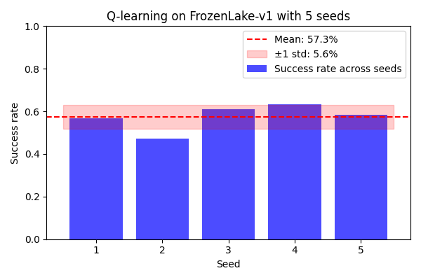
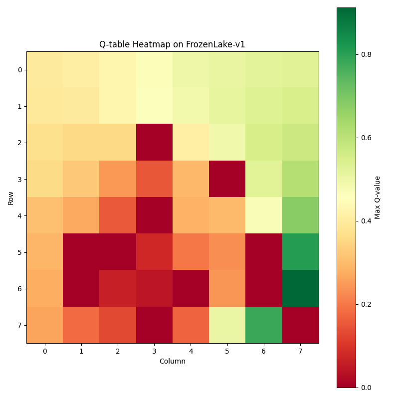
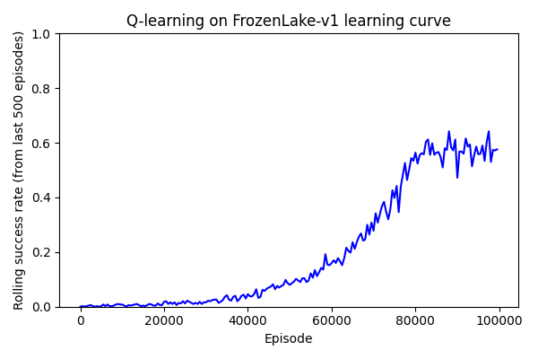
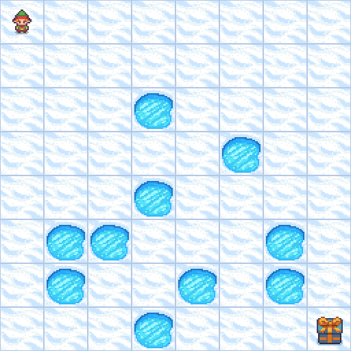
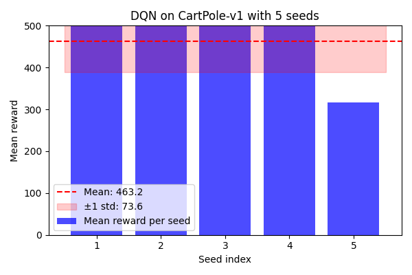
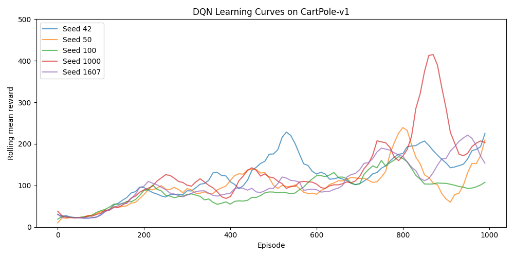
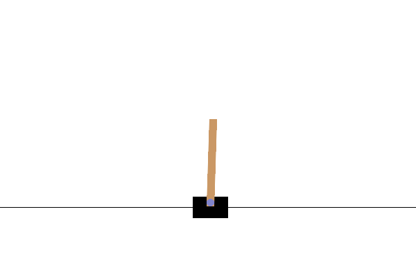

# Reinforcement Learning From Scratch

Tabular Q-learning and DQN implemented from first principles in PyTorch, evaluated on Gymnasium benchmarks with seeded runs, W&B experiment tracking, and a technical journal documenting design decisions and lessons learned.

## Results

| Algorithm | Environment | Mean Return (5 seeds) | Std |
|-----------|-------------|--------------| ----- |
| Q-learning | FrozenLake-v1 | 57.3%        | ±5.6% |
| DQN | CartPole-v1 | 463.2 / 500  | ±73.6 |

### Q-learning — FrozenLake-v1

<table>
  <tr>
    <td></td>
    <td></td>
  </tr>
</table>
<td></td>

#### Learning Progression
| Early (Episode 1,000) | Mid (Episode 50,000) | Final (Episode 99,999) |
|----------------------|---------------------|----------------------|
|  |  |  |

### DQN — CartPole-v1

<table>
  <tr>
    <td align="center"></td>
    <td align="center"></td>
  </tr>
</table>

#### Learning Progression
| Early (Episode 50)                           | Mid (Episode 500) | Best Policy Learned                            |
|----------------------------------------------|------------------|------------------------------------------------|
|  |  |  |
 > Click the gifs to see the algorithm in action

## Installation

1. `pip install torch`
2. `pip install -e ".[dev]"`

> DQN currently runs using CPU. GPU support depends on hardware and ROCm/CUDA compatibility. As the environments here are low complexity, the CPU is sufficient.

## Usage
```bash
python algorithms/q_learning.py     # Train Q-learning on FrozenLake environment
python algorithms/dqn.py            # Train DQN on CartPole environment
python scripts/run_q_learning.py    # Run Q-learning over 5 seeds
python scripts/run_dqn.py           # Run DQN over 5 seeds
```

## Experiment Tracking

All runs are logged to Weights & Biases, with each run stating its seed and full hyperparameter configuration so every result can be fully reproduced.

## Journal
The journal here logs the decisions made, problems encountered; solutions to them, and the lessons learned throughout this project: [JOURNAL.md](JOURNAL.md)